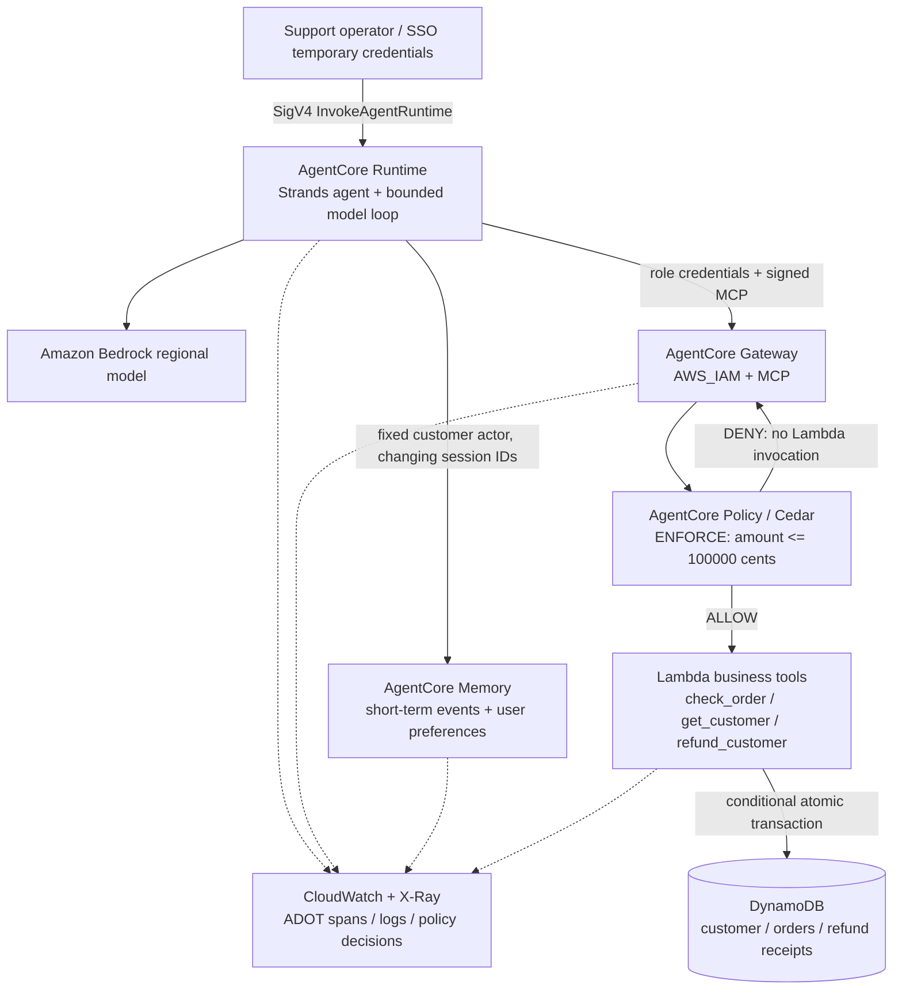

# Architecture

`get_customer` takes no identity argument; `check_order` and `refund_customer` take
only order/operation details. Runtime and Lambda receive the same customer ID from
CloudFormation. The IAM caller is a support operator authorized for that deployment.

For a refund, Lambda atomically inserts a durable operation receipt and decrements
the order's refundable balance. The operation key is customer-scoped. A repeated
key with identical parameters returns the same receipt; different parameters
produce `IDEMPOTENCY_CONFLICT`. Receipts have no TTL. A new operation still cannot
exceed the remaining order balance. There is no external payment side effect.

Memory persists messages under the configured customer actor. The preference
strategy extracts long-term records under `/preferences/{actorId}/`; a new runtime
session queries the same actor namespace. Extraction is asynchronous, so the live
test polls for the record before starting its second session. A preference about
`eu-west-1` does not change the infrastructure's region.

There is deliberately no direct Runtime-to-Lambda or Runtime-to-DynamoDB IAM grant.
The caller cannot alter policies or supply a different customer identity through
the request. Gateway starts with an empty enforcing engine, therefore denies tools
until the policies are created. CloudFormation creates policies after the target
schema exists and creates Runtime after those policies.
